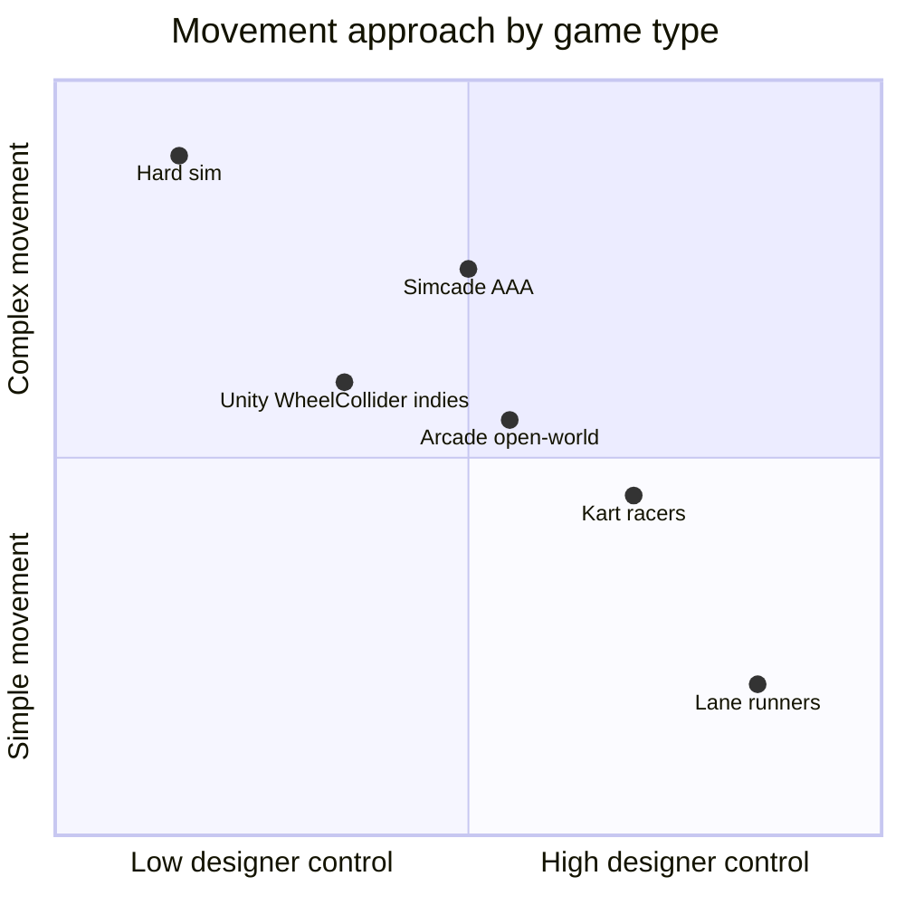

# Driving Game Movement — Research Notes

Research on common approaches to vehicle movement in games, what makes driving feel good, and how different genres typically implement it.

---

## The Big Picture: Two Philosophies

Most discussions boil down to two starting points ([Game Developer – Livio De La Cruz](https://www.gamedeveloper.com/design/implementing-racing-games-an-intro-to-different-approaches-and-their-game-design-trade-offs)):

| Approach | You start with… | You end up… |
|----------|-----------------|-------------|
| **Physics-first** | Wheels, torque, suspension, friction | Tuning down complexity with assists, anti-roll, grip hacks |
| **Arcade-first** | Almost nothing | Adding only the mechanics your game needs |

Wheel-collider driving is **one flavor of physics-first**. It is common in Unity tutorials and many “drive a car on a track” games — but it is **not** the default for lane runners, kart racers, or anything that needs snappy, designer-controlled handling.

Criterion (Burnout / Need for Speed) famously uses real physics **plus a large layer of feel systems** — camera, assists, scripted corrections — not raw wheel simulation alone:

- **GDC Vault (session page):** [Vehicle Feel Masterclass: Balancing Arcade Accessibility with Simulation Depth](https://www.gdcvault.com/play/1025383/Vehicle-Feel-Masterclass-Balancing-Arcade)
- **Video (GDC YouTube):** [Vehicle Feel Masterclass — Matthew Harris (Criterion Games)](https://www.youtube.com/watch?v=n_A0RqeGado)
- **Slides (PDF):** [Harris_Matthew_VehicleFeelMasterclass.pdf](https://media.gdcvault.com/gdc2018/presentations/Harris_Matthew_VehicleFeelMasterclass.pdf)

---

## The 6 Movement Patterns You'll See in Practice

### 1. Kinematic Lane Movement (most common for lane-runner genre)

**How it works:** Integer lane index → target X → `Lerp` / `SmoothDamp` / `MoveTowards` each frame. Forward motion is often **faked** (world scrolls, player stays near origin).

**Why it feels good:** Direct control over lane commit time. No fighting the physics engine. Easy to interrupt mid-lane-change (tap left then right quickly).

**Examples:**

- **Subway Surfers**, **Temple Run**, **Minion Rush** — classic 3-lane endless runners
- Typical Unity/Godot tutorials for this genre use exactly this pattern ([gameidea.org endless runner tutorial](https://gameidea.org/2024/10/01/making-3d-endless-runner-game-part-1/), [Stack Overflow lane lerp pattern](https://stackoverflow.com/questions/29184972/how-to-change-lane-smoothly))

---

### 2. Scripted Arcade Vehicle (single collider, no wheels)

**How it works:** One `Rigidbody` + box/sphere collider. Acceleration and steering are **authored** — circle-radius turning, direct velocity, drift states, speed-capped steer angle.

**Why it feels good:** Predictable. “100% grip” when you want it. Designers sculpt curves instead of debugging tire slip.

**Examples:**

- **Rocket League** — Psyonix GDC: mostly **one box collider** per car; more precise collision was rejected as too random
- **Mario Kart** (modern) — widely believed to use custom logic, not wheel colliders; track often adapts to the kart as much as the kart to the track ([Unity community reverse-engineering discussions](https://discussions.unity.com/t/mario-kart-physics/624727))
- **F-Zero**, **TrackMania** — highly authored speed/turn relationships

---

### 3. Custom Raycast Vehicle (popular Unity indie pattern)

**How it works:** Rays from each wheel corner → spring suspension → longitudinal drive force + **lateral grip force** (cancel sideways slip). Visual wheels are decoupled from physics.

**Why it feels good:** Full control over arcade drift and grip without PhysX wheel quirks. Lighter than `WheelCollider`.

**Examples:**

- Many Unity arcade racer tutorials and open-source kits ([mactinite/RaycastVehicle](https://github.com/mactinite/RaycastVehicle), [BarkarIvan/ArcadeVehiclePhysics](https://github.com/BarkarIvan/ArcadeVehiclePhysics))
- Common for **open-track arcade racers** and stunt games where you need slopes/ramps but not simulation depth

**Note:** Unity's `WheelCollider` is *also* internally a raycast — but with less designer control ([Unity WheelCollider docs](https://docs.unity3d.com/Manual/wheel-colliders-introduction.html)).

---

### 4. WheelCollider / Motor-Torque Driving

**How it works:** Per-wheel steer angle, motor torque, brake torque, suspension. Forces emerge from tire friction model.

**Why teams use it:** Good starting point for “car on ground” in Unity. Feels plausible on uneven terrain. Open steering angle, not discrete lanes.

**Downsides for feel tuning:**

- Many variables affect the same symptom (mass, torque, slip, suspension, wheelbase…)
- Cars tip, bounce, and slide in “correct” but unfun ways unless you add anti-roll, downforce, steer limits
- High-speed steering must be capped or wheels act like brakes
- Curb/step handling is notoriously poppy (Unity docs warn about this)

**Examples:**

- Unity's official vehicle tutorial
- Many Asset Store car controllers
- Some **simcade** indies before they add custom layers

**Best when:** Open roads, free steering, ramps, multi-surface driving, or you want sim-adjacent handling with assists.

---

### 5. Simcade Tire Models (AAA / large-studio)

**How it works:** Custom friction curves, speed-based assists, designer-friendly parameters instead of full Pacejka magic formula.

**Examples:**

- **Forza** — physics-backed but heavily assisted and tuned per car
- **Need for Speed / Burnout lineage** — physics foundation + camera + assists + corrections
- **Just Cause 4** — GDC talk explicitly moved *away* from complex tire models toward fewer, designer-friendly params ([GDC Vault – JC4 tire dynamics](https://www.gdcvault.com/play/1026468/Vehicle-Physics-and-Tire-Dynamics))

---

### 6. Full Simulation (niche, not “common” for feel-first games)

**Examples:**

- **BeamNG.drive** — soft-body nodes/beams per vehicle part ([BeamNG wheel docs](https://documentation.beamng.com/modding/vehicle/sections/wheels/))
- **iRacing**, **Assetto Corsa** — simulation-first

These optimize for believability, not snappy lane changes or arcade pickup gameplay.

---

## What Actually Makes Driving “Feel Good”

Across genres, feel rarely comes from “more realistic physics.” It comes from **direct control of player intent**:

| Lever | What players perceive |
|-------|------------------------|
| **Response time** | How fast input becomes motion (lane commit, turn-in) |
| **Grip vs slide** | Predictable path vs drift fantasy |
| **Speed-scaled steering** | Tight turns at low speed, stable at high speed |
| **Acceleration curve** | Snappy launch vs smooth cruise |
| **Visual layer** | Body roll, yaw, brake dive, camera FOV/shake (Criterion emphasizes camera heavily) |
| **Forgiveness** | Soft curb hits, auto-centering, input buffering |

For lane games, **response time and predictability** matter most. For open-track racers, **turn radius vs speed** and **drift state** matter most. Wheel colliders optimize neither of those out of the box.

---

## Genre → Typical Implementation

| Game type | Common approach | Examples |
|-----------|-----------------|----------|
| 3-lane endless runner | Kinematic lerp + scroll world | Subway Surfers, Temple Run |
| Arcade kart / combat racer | Custom single-collider or raycast + authored turn | Mario Kart, Rocket League |
| Open arcade racer | Raycast vehicle or WheelCollider + heavy assists | Many Unity indies, some MotorStorm-style games |
| Simcade | Custom tire model + assists | Forza, NFS, Dirt |
| Simulation | Full physics | BeamNG, iRacing |
